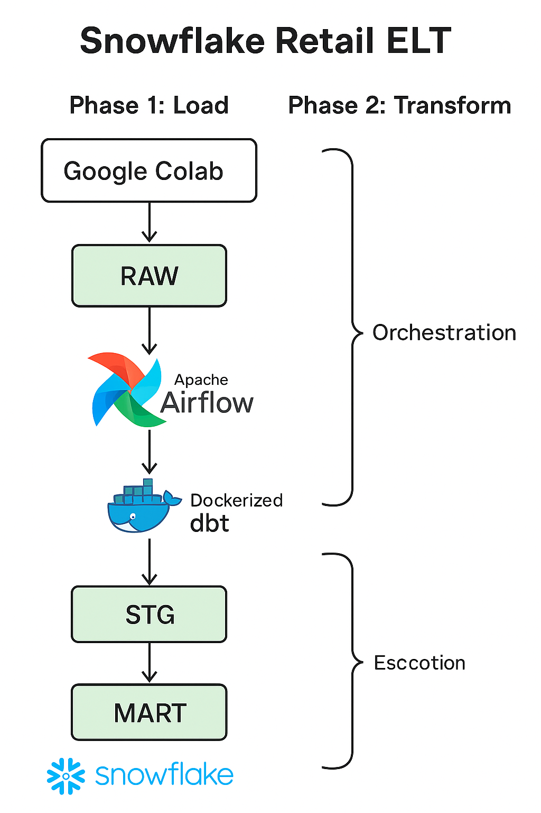

# SNOWFLAKE RETAIL ELT

A containerized, orchestration-first ELT pipeline for e-commerce analytics.


---

## Table of Contents

1. [Project Genesis](#project-genesis)  
2. [System Architecture Blueprint](#system-architecture-blueprint)  
3. [Core Directives & What Changed](#core-directives--what-changed)  
4. [Technology Matrix](#technology-matrix)  
5. [Operational Flow & Concrete Commands (what to run where)](#operational-flow--concrete-commands-what-to-run-where)  
   * [Phase 1 — Data Ingestion (Google Colab) — final code cell](#phase-1---data-ingestion-google-colab---final-code-cell)  
   * [Phase 2 — Data Transformation (dbt & Airflow)](#phase-2---data-transformation-dbt--airflow)  
6. [Snowflake: exact DDL & objects to create (copy/paste)](#snowflake-exact-ddl--objects-to-create-copypaste)  
7. [dbt: sources, staging models, marts, tests (what we changed)](#dbt-sources-staging-models-marts-tests-what-we-changed)  
8. [Verification & troubleshooting commands (Snowflake / Colab)](#verification--troubleshooting-commands-snowflake--colab)  
9. [Tactical Solutions & lessons learned](#tactical-solutions--lessons-learned)  
10. [Recommended next steps / Improvements](#recommended-next-steps--improvements)

---

## Project Genesis

This repository implements a complete end-to-end ELT (Extract → Load → Transform) pipeline. The updated process uses Colab to download/upload CSVs, Snowflake for storage and compute, dbt Core for transformations, and Airflow for orchestration — but now with structured RAW tables and a robust, repeatable ingestion pattern.

---

## System Architecture Blueprint



**Caption:** Two-phase ELT process:

1. **Load (L)** — Colab downloads dataset and uploads CSVs to Snowflake table stages; `COPY INTO` loads into structured `ECOMMERCE.RAW` tables using a named file format.
2. **Transform (T)** — Airflow triggers dbt inside Docker to build staging views (`STG`) and marts (`MART`).
3. **Orchestration** — Airflow DAG runs `dbt run`, `dbt test`, and optionally `dbt snapshot`.
4. **End Product** — Clean, tested tables in `MART`, ready for BI.

---

## Core Directives & What Changed

* **Before (old)** — Colab created `RAW.<table>` as `raw VARIANT` and uploaded JSON-like rows (OBJECT_CONSTRUCT), dbt had JSON-extraction logic.
* **Now (current)** — We:
  * **Create typed tables** in `ECOMMERCE.RAW` (INT / STRING / DATE / FLOAT etc.).
  * **Create a named file format** (`CSV_FORMAT`) in Snowflake.
  * **Colab uploads CSVs** to table stages (via `PUT`) and runs `COPY INTO RAW.<table>` referencing `CSV_FORMAT`.
  * **Removed any `CREATE OR REPLACE TABLE RAW.<table> (raw VARIANT)`** lines from Colab — tables are created once in Snowflake and not overwritten by ingestion.
  * **dbt sources** use a single source name (`raw`) and staging models now select columns directly from `{{ source('raw','<table>') }}`.
  * **Airflow** continues to call dbt (we recommend switching to `DbtCliOperator` later).

---

## Technology Matrix

| Category | Technology / Service | Purpose |
| :--- | :--- | :--- |
| Ingestion | Google Colab, Kaggle API | Dataset download & upload |
| Data Warehouse | Snowflake | Storage + compute; structured RAW tables |
| Transformation | dbt Core | Modeling, testing, docs |
| Orchestration | Apache Airflow | Scheduling & running dbt |
| Containerization | Docker & Docker Compose | Airflow + dbt runtime |
| Language | Python | Colab scripts + Airflow DAGs |
| Dataset | Synthetic E-Commerce (Nael Aqel, Kaggle) | Example data |

---

## Operational Flow & Concrete Commands (what to run where)

### Phase 1 — Data Ingestion (Google Colab) — final code cell

**Important rules**
* Do **not** recreate tables in the notebook.
* Use a named file format in Snowflake (we create `CSV_FORMAT`).
* Upload (PUT) files to their respective table stages and run `COPY INTO RAW.<TABLE>` referencing the file format.

**Final ingestion loop to paste into Colab**:

```python
# (Colab) final ingestion cell — paste & run after creating tables + FILE FORMAT in Snowflake
from pathlib import Path
import os
import snowflake.connector

# assume ctx and cs already created using env vars
# ctx = snowflake.connector.connect(user=..., password=..., account=..., warehouse=..., database='ECOMMERCE', schema='RAW')
# cs = ctx.cursor()

csv_dir = "/content/drive/MyDrive/ecom_data/csv"   # adjust to your path
files = [f for f in os.listdir(csv_dir) if f.endswith('.csv')]

# Ensure proper context
cs.execute("USE DATABASE ECOMMERCE")
cs.execute("USE SCHEMA RAW")

for file in files:
    full_path = str(Path(csv_dir) / file)
    table_name = file.replace(".csv", "").upper()

    print(f"Uploading {file} -> @{table_name}")

    # 1) Upload file to table stage
    cs.execute(f"PUT file://{full_path} @%{table_name} AUTO_COMPRESS=TRUE OVERWRITE=TRUE")

    # 2) Load into the existing structured table using the named file format
    cs.execute(f"""
        COPY INTO RAW.{table_name}
        FROM @%{table_name}
        FILE_FORMAT = (FORMAT_NAME = 'ECOMMERCE.CSV_FORMAT')
        ON_ERROR = 'CONTINUE'
    """)

    # 3) Optional verification (row count)
    cnt = cs.execute(f"SELECT COUNT(*) FROM RAW.{table_name}").fetchone()[0]
    print(f"Loaded {cnt} rows into RAW.{table_name}")
```

> **Note:** This loop does not create or drop tables. Tables must exist beforehand (see Snowflake DDL below).

---

### Phase 2 — Data Transformation (dbt & Airflow)

* Airflow DAG (`dbt_pipeline.py`) stays largely the same but must ensure it sets these env vars for dbt:
  * `SF_USER`, `SF_PASSWORD`, `SF_ACCOUNT`, `SF_ROLE`, `SF_WAREHOUSE`, `SF_DATABASE`, `SF_SCHEMA`.
* dbt `profiles.yml` reads credentials via `env_var()` — keep this unchanged, just ensure Airflow connection contains the correct extra JSON and credentials.
* Replace any prior JSON/VARIANT extraction in staging models with direct column selects.

**Example Airflow DAG snippet :**

```python
from airflow.hooks.base import BaseHook
from airflow import DAG
from airflow.operators.bash import BashOperator

sf_conn = BaseHook.get_connection("eco_snow")

sf_env = {
    "SF_USER": sf_conn.login or "",
    "SF_PASSWORD": sf_conn.password or "",
    "SF_ACCOUNT": sf_conn.extra_dejson.get("account", ""),
    "SF_ROLE": sf_conn.extra_dejson.get("role", ""),
    "SF_WAREHOUSE": sf_conn.extra_dejson.get("warehouse", ""),
    "SF_DATABASE": sf_conn.extra_dejson.get("database", "ECOMMERCE"),
    "SF_SCHEMA": sf_conn.extra_dejson.get("schema", "RAW"),
}

DBT = "/home/airflow/.local/bin/dbt"
PROJECT_DIR = "/opt/airflow/dags/dbt_project"

with DAG(...) as dag:
    dbt_run = BashOperator(
        task_id="dbt_run",
        bash_command=f"cd {PROJECT_DIR} && {DBT} run --profiles-dir {PROJECT_DIR}",
        env=sf_env,
    )
```

---

## Snowflake: exact DDL & objects to create (copy/paste)

Run these statements **once** (Snowsight or via your preferred SQL runner). They set the database, schema, tables, and file format used by the Colab loader.

```sql
-- 1) Create DB + schema
CREATE DATABASE IF NOT EXISTS ECOMMERCE;
CREATE SCHEMA IF NOT EXISTS ECOMMERCE.RAW;

USE DATABASE ECOMMERCE;
USE SCHEMA RAW;

-- 2) Create structured RAW tables (copy & paste for all)
CREATE OR REPLACE TABLE CUSTOMERS (
  customer_id NUMBER,
  name VARCHAR,
  email VARCHAR,
  gender VARCHAR,
  signup_date DATE,
  country VARCHAR
);

CREATE OR REPLACE TABLE PRODUCTS (
  product_id NUMBER,
  product_name VARCHAR,
  category VARCHAR,
  price FLOAT,
  stock_quantity NUMBER,
  brand VARCHAR
);

CREATE OR REPLACE TABLE ORDERS (
  order_id NUMBER,
  customer_id NUMBER,
  order_date DATE,
  total_amount FLOAT,
  payment_method VARCHAR,
  shipping_country VARCHAR
);

CREATE OR REPLACE TABLE ORDER_ITEMS (
  order_item_id NUMBER,
  order_id NUMBER,
  product_id NUMBER,
  quantity NUMBER,
  unit_price FLOAT
);

CREATE OR REPLACE TABLE PRODUCT_REVIEWS (
  review_id NUMBER,
  product_id NUMBER,
  customer_id NUMBER,
  rating NUMBER,
  review_text VARCHAR,
  review_date DATE
);

-- 3) Create a reusable FILE FORMAT (used by COPY INTO)
CREATE OR REPLACE FILE FORMAT ECOMMERCE.CSV_FORMAT
  TYPE = 'CSV'
  FIELD_DELIMITER = ','
  FIELD_OPTIONALLY_ENCLOSED_BY = '"'
  SKIP_HEADER = 1
  TRIM_SPACE = TRUE
  NULL_IF = ('');
```

**Important:** Do **not** run any `CREATE OR REPLACE TABLE RAW.<table> (raw VARIANT)` commands anymore — those overwrite the structured tables.

---

## dbt: sources, staging models, marts, tests (what we changed)

### 1) `models/sources.yml` (single place to declare sources — **source name = `raw`**)

```yaml
version: 2

sources:
  - name: raw
    database: ECOMMERCE
    schema: RAW
    tables:
      - name: customers
      - name: products
      - name: orders
      - name: order_items
      - name: product_reviews
```

> **Important:** keep the `sources:` declaration in **one** file only (e.g., `models/sources.yml`). Remove any duplicate `sources:` declarations in other files (we fixed a duplicate in `models/marts/schema.yml` earlier).

---

### 2) Staging models (materialized as views) — `models/staging/*.sql`

Example `models/staging/stg_customers.sql`:

```sql
{{ config(materialized='view') }}

select
  customer_id,
  name,
  email,
  gender,
  signup_date,
  country
from {{ source('raw', 'customers') }}
```

Repeat similar straightforward selects for `stg_products`, `stg_orders`, `stg_order_items`, `stg_product_reviews` (we created these during fixes).

**Important dbt note:** Do **not** end model files with semicolons. dbt compiles and runs the SQL without a trailing `;`.

---

### 3) Marts & facts (materialized as tables) — examples

`models/marts/dim_customers.sql`:

```sql
{{ config(materialized='table') }}

select
  customer_id,
  name,
  email,
  gender,
  signup_date,
  country
from {{ ref('stg_customers') }}
```

`models/marts/fact_order_items.sql` (example):

```sql
{{ config(materialized='table') }}

select
  oi.order_item_id,
  oi.order_id,
  oi.product_id,
  oi.quantity,
  oi.unit_price,
  oi.quantity * oi.unit_price as line_total,
  o.customer_id,
  p.product_name
from {{ ref('stg_order_items') }} oi
left join {{ ref('stg_orders') }} o on oi.order_id = o.order_id
left join {{ ref('stg_products') }} p on oi.product_id = p.product_id
```

---

### 4) `models/schema.yml` — model tests (example)

```yaml
version: 2

models:
  - name: stg_customers
    columns:
      - name: customer_id
        tests: [not_null, unique]

  - name: stg_orders
    columns:
      - name: order_id
        tests: [not_null, unique]
      - name: customer_id
        tests:
          - not_null
          - relationships:
              to: ref('stg_customers')
              field: customer_id

  - name: stg_products
    columns:
      - name: product_id
        tests: [not_null, unique]

  - name: stg_order_items
    columns:
      - name: order_item_id
        tests: [not_null, unique]
      - name: order_id
        tests:
          - not_null
          - relationships:
              to: ref('stg_orders')
              field: order_id
      - name: product_id
        tests:
          - not_null
          - relationships:
              to: ref('stg_products')
              field: product_id
```

---

## Verification & troubleshooting commands (Snowflake / Colab)

**Snowflake (use Snowsight worksheet):**

```sql
-- Confirm table structure (should list columns, NOT VARIANT)
DESC TABLE ECOMMERCE.RAW.CUSTOMERS;

-- Confirm stage upload
LIST @%CUSTOMERS;

-- Preview how Snowflake parses the stage file using the file format
SELECT $1, $2, $3, $4, $5, $6
FROM @%CUSTOMERS (FILE_FORMAT => 'CSV_FORMAT')
LIMIT 5;

-- Copy validation (if a COPY loaded 0 rows, inspect errors)
COPY INTO ECOMMERCE.RAW.CUSTOMERS 
  FROM @%CUSTOMERS (FILE_FORMAT => 'CSV_FORMAT') 
  VALIDATION_MODE = 'RETURN_ERRORS';

-- Verify final counts
SELECT COUNT(*) FROM ECOMMERCE.RAW.CUSTOMERS;
SELECT * FROM ECOMMERCE.RAW.CUSTOMERS LIMIT 10;
```

**Colab / Python (after each PUT):**

```python
# Verify the file is on the stage
cs.execute(f"LIST @%{table_name}")
print(cs.fetchall())
```

**dbt (run in Airflow container or locally inside dbt project):**

```bash
# inside container/project dir
dbt deps
dbt seed     # if you have seeds
dbt run
dbt test
dbt docs generate
dbt docs serve   # locally to inspect docs
```

If dbt errors reference duplicate sources, ensure there is **only one** `sources:` declaration (we fixed duplicates earlier).

---

## Tactical Solutions & lessons learned

* **Named file format** avoids quoting / parser issues and produces consistent loads.  
* **Do not create/override RAW tables from ingestion script** — create once in Snowflake and keep ingestion focused on stage+copy.  
* **Avoid VARIANT unless you explicitly want raw JSON** — typed columns simplify dbt and BI.  
* **dbt source declaration must exist in one place** (avoid duplicates).  
* **dbt models must not end with semicolons**; trailing semicolons caused compilation errors.  
* **Airflow job logs**: ensure file permissions for mounted folders (chown to Airflow UID) and use absolute dbt binary path in DAG.

---

## Recommended next steps / Improvements

1. Replace `BashOperator` with `DbtCliOperator` in Airflow for clearer dbt steps.  
2. Add CI (GitHub Actions) to run `dbt test` on PRs.  
3. Consider SCD2 snapshots for `customers` and `products` if tracking history is required.  
4. Add monitoring for Snowflake costs and query performance.  
5. Create a simple BI dashboard (Power BI / Looker / Tableau) pointed at `MART` schema.

---


```
Thank You.